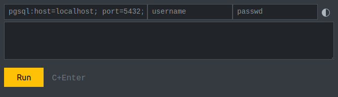

# PDO Console

Веб-консоль на `PHP`, позволяет работать с любыми базами данных через [PDO](https://www.php.net/manual/ru/class.pdo), создана по аналогии с веб-консолью [ClickHouse](https://play.clickhouse.com/play?user=play).

## Описание

Редактора данных в текущей версии нет, есть только просмотр результата `SELECT` запроса, и отображение количества затронутых строк в остальных видах запросов.

Для одновременной работы с разными базами данных можно использовать параметр `?prefix=<название>`

При перезагрузке консоли выполнение последнего запроса НЕ присходит, для его запуска необходимо нажать кнопку `Run` или нажать на клавиатуре `Ctrl+Enter` или `Cmd+Enter`.

В текстовом поле SQL-запроса можно вводить отступы (шириной 4 пробела) кнопкой `Tab`, для возврата на предыдущие поля работает сочетание `Shift+Tab`. Есть автоотствуп, при нажатии `Enter` добавляются знаки пробела и табуляции с текущей строки.

Вводимый запрос сохраняется в адресной строке в `base64` кодировке после символа `#` по мере ввода (по событиям `onkeydown` и `onchange`), при перезагрузке страницы он будет раскодирован и помещён в поле ввода. При передаче кому-либо такой ссылки, передаётся лишь SQL-запрос без данных подключения к базе данных, их необходимо будет ввести вручную.

Выполненные SQL-запросы сохраняются в хранилище сеанса браузера `sessionStorage`, который стирается после закрытия вкладки с консолью. Стрелками справа внизу под полем ввода запроса можно перелистывать историю запросов, листать историю можно кнопками `Alt+Left/Right`. Если запрос уже есть в истории, то при запуске он переместится в конец списка. Если при переходе текущего запроса нет в хранилище (не был запущен), то чтобы его не потерять, он будет размещён в конце списка.

Запросы `UPDATE` и `DELETE` нельзя выполнить без оператора `WHERE`, это сделано для того, чтобы случайно не запустить не до конца введённый запрос, ведь `WHERE` вводится в последнюю очередь, и если случайно нажать `Ctrl+Enter`, то можно сильно повредить данные.

Время выполнения запроса в миллисекундах не учитывает время формирования его вывода, это то время, которое затрачивает база данных для его выполнения.

Если в таблице результата запроса более одного столбца, при нажатии на номер строки столбцы разворачиваются в строковое представление, повторное нажатие на номер строки возвращает прежний вид.

Вывод ограничен 1000 строками, для вывода остальных записей используйте SQL-операторы `LIMIT` и `OFFSET`.

Для удобства работы в некоторых базах данных создана замена определённых запросов на аналоги в этой базе данных:

* pgsql: `show databases` или `\l` = `SELECT datname FROM pg_database WHERE datistemplate=false ORDER BY datname`;
* pgsql: `show tables` или `\d` = `SELECT tablename FROM pg_catalog.pg_tables WHERE schemaname='public' ORDER BY tablename`;
* pgsql: `show fields|columns from|in table_name` или `\d table_name` = `SELECT column_name,data_type,is_nullable,column_default FROM information_schema.columns WHERE table_name='table_name' ORDER BY ordinal_position`;
* pgsql: `describe table table_name` или `\d+ table_name` = `SELECT * FROM information_schema.columns WHERE table_name='table_name' ORDER BY ordinal_position`;
* sqlite: `show tables` или `\d` или `.tables` = `SELECT * FROM sqlite_schema`;
* sqlite: `show fields|columns from|in table_name` или `\d table_name` = `PRAGMA table_info(table_name)`;

Можно выбрать светлую и тёмную тему оформления, переключаются нажатием на иконку справа сверху. Выбранная тема сохраняется в локальном хранилище `localStorage` без префикса базы данных. Можно переключать тему сочетанием кнопок `Ctrl+B`.

Все необходимые для работы файлы находятся внутри скрипта `pdoconsole.php`, и загружаются однократно вместе с телом страницы. Кроме нескольких иконок, внедрён код библиотек: `bootstrap.min.css` для стилизации консоли, и `htmx.min.js` для AJAX-запросов к серверу.

## Безопасность

Строка подключения к базе данных, имя пользователя и пароль, хранятся в зашифрованном виде (`AES128`) в `cookie` вашего браузера в течении года от последнего использования, срок хранения можно изменить в константе `COOKIE_EXPIRES`. Для надёжного хранения этих данных необходимо поменять значение константы `CRYPT_PASS` на своё уникальное значение.

От межсайтовых запросов консоль защищена проверкой `md5` хеша ключа шифрования `CRYPT_PASS`, и наличием пароля к базе данных в теле запроса.

С осторожностью используйте консоль на сайтах, где может быть внедрён чужой JS-код, так как он может получить доступ к вашим SQL-запросам во время сеанса работы с консолью, в это время не открывайте сайт в этом же браузере.

Если вы получили ссылку с запросом на свою консоль от других людей, внимательно проверяйте тело запроса перед запуском на отсутствие опасных команд, например, стирания или изменения записей в базе данных: `DROP`, `DELETE`, `UPDATE`.

## Установка

Работа PDO Console проверялась в PHP 5.6, 7.0, 8.1, должна работать начиная с версии PHP 5.4

Скрипт `pdoconsole.php` можно положить в любое место вашего сайта, желательно переименовать файл, чтобы к нему не получили доступ через стандартное имя файла, с удалёнными серверами необходимо работать только через протокол `https`, так как пароль передаётся на сервер в теле POST-запроса.

Для работы с нужной вам базой данных необходимо установить соответствующий пакет, например: `php-sqlite3`, `php-mysql`, `php-pgsql`.

Перед использованием поменяйте значение константы `CRYPT_PASS` (в начале файла) на любое случайное значение.

Запускать скрипт можно через встроенный в PHP веб-сервер:

	$ php -S localhost:8089 pdoconsole.php
