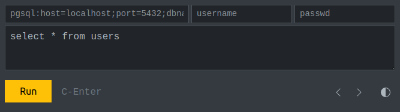

# PDO Console

Веб-консоль на PHP, позволяет работать с любыми базами данных через [PDO](https://www.php.net/manual/ru/class.pdo), создана по аналогии с веб-консолью [ClickHouse](https://play.clickhouse.com/play?user=play).

## Описание

Редактора данных нет, есть только просмотр результата `SELECT` запроса, и отображение количества затронутых строк в остальных видах запросов.

Строка подключения, имя пользователя, пароль, и последний SQL-запрос, хранятся в `localStorage` вашего браузера.

Для одновременной работы с разными базами данных можно использовать параметр `?prefix=<название>`

При загрузке консоли выполнение последнего запроса НЕ присходит, для его запуска необходимо нажать кнопку `Run` или нажать на клавиатуре `Ctrl+Enter` или `Cmd+Enter`.

В текстовом поле SQL-выражения можно вводить отступы (шириной 4 пробела) кнопкой `Tab`, для возврата на предыдущие поля работает сочетание `Shift+Tab`.

Есть светлая и тёмная тема оформления, переключаются нажатием на иконку справа сверху. Выбранная тема сохраняется в `localStorage` без префикса.

Если более одного столбца в выдаче, то при нажатии на номер строки столбцы разворачиваются в строковое представление, повторное нажатие на номер строки возвращает прежний вид.

Вывод ограничен 1000 строками (можно поменять в скрипте), для вывода остальных записей используйте параметры `LIMIT` и `OFFSET`.

Все необходимые для работы файлы находятся внутри скрипта `pdoconsole.php`, и загружаются однократно вместе с телом страницы. Кроме нескольких иконок, внедрён код библиотек: `bootstrap.min.css` для стилизации консоли, и код `htmx.min.js` для AJAX-запросов к серверу.

## Безопасность

От межсайтовых запросов консоль защищена тем, что передаёт пароль подключения к базе в теле запроса, `Cookie` не используются.

С осторожностью используйте консоль на тех сайтах, где есть риск внедрения чужеродного JavaScript-кода, который сможет получить доступ к `localStorage`, в крайнем случае стирайте пароль после использования консоли.

## Использование

Скрипт `pdoconsole.php` можно положить в любое место вашего сайта, желательно переименовать файл, чтобы к нему не получили доступ указав стандартное имя файла, с удалёнными серверами необходимо работать только через протокол `https`, так как пароль передаётся на сервер в теле POST-запроса.

Для работы скрипта можно использовать встроенный в PHP веб-сервер:

	$ php -S localhost:8089 pdoconsole.php
